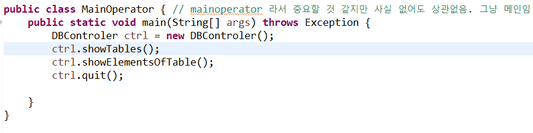
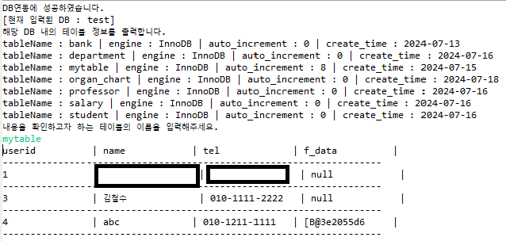
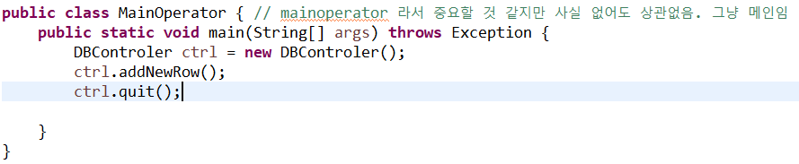
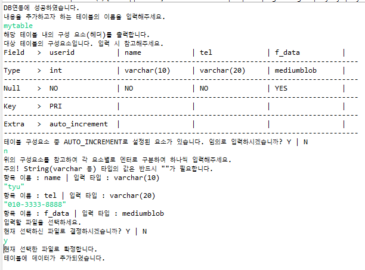
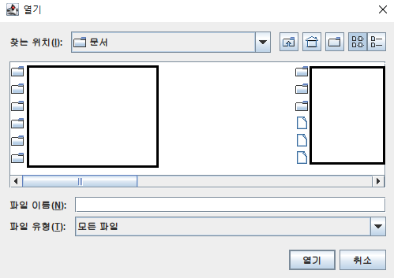
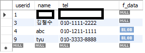

#   mySql과 간단하게 연결하고 조작할 수 있는 컨트롤러를 만들자

##  1. 완성 이미지

번호|이미지
---|---|
**1**|
**2**|
**3**|
**4**|
**5**|
**6**|

##  2. 코드

이것을 실행시키기 위해서는 mysql 드라이버 라이브러리를 빌드패스에 추가해야 합니다.

## main : MainOperator
메인은 별 의미 없음. 그냥 실행시키는 역할. 그리고 메서드 소개하는 정도
~~~java
package mySqlConnection;

/*
 * TableControler
 * 생성자로 만들고 나서 내부 메서드 사용하면 됨.
 * 그리고 사용한 뒤에 마지막에 반드시 quit 쓸 것. 그래야 깔끔하게 종료됨.
 * 메서드 목록은 아래에서 확인할 것
 */

public class MainOperator { // mainoperator 라서 중요할 것 같지만 사실 없어도 상관없음. 그냥 메인임
    public static void main(String[] args) throws Exception {
    	DBControler ctrl = new DBControler();
    	
    }
}

/* 
 * 메서드 목록
 * 
 * 1. showDBs()
 *  : DB 목록을 콘솔에 출력
 *  
 * 2. showAllDBUser()
 *  : DB에 저장된 모든 유저 정보를 콘솔에 출력
 *  
 * 3. createDBUser()
 *  : DB에 신규 유저 생성
 * 
 * 4. removeDBUser()
 *  : DB에 저장된 유저 삭제
 * 
 * 5. changeDBUserPW()
 *  : DB에 저장된 유저의 비밀번호 변경.
 * 
 * 6. showAuthorityOfDBUser()
 *  : DB 내 특정 유저가 보유 중인 권한 목록을 콘솔에 출력
 *  
 * 7. authorizeDBUserTo()
 *  : DB 내 특정 유저에게 특정 DB > 특정 테이블에 관한 권한 부여. 전체 권한 부여도 가능.
 * 
 * 8. unauthorizeDBUserTo()
 *  : DB 내 특정 유저에게 특정 DB > 특정 테이블에 관한 권한 박탈. 전체 권한 박탈도 가능.
 * 
 * 9. createNewTable()
 *  : DB 내에 신규 테이블 생성.
 *    순수하게 구성 요소에 관한 것만 입력하기 때문에 각 구성요소 사이의 \", \"와 시작/종료할 때의 괄호 및 문구는 입력하지 않음.
 *    각 구성 요소는 엔터로 구분하며, 아무것도 입력하지 않고 엔터치면 종료.
 *    
 * 10. removeTable()
 *  : DB 내에 등록된 테이블 삭제.
 *  
 * 11. showTables()
 *  : DB 내에 등록된 테이블들의 목록을 콘솔에 촐력
 * 
 * 12. showSchemaOfTable()
 *  : 특정 테이블의 schema에 대한 정보를 출력
 * 
 * 13. showElementsOfTable()
 *  : 특정 테이블의 요소를 모두 콘솔에 출력
 *  
 * 14. addNewCol()
 *  : 특정 테이블에 column 추가
 *  
 * 15. removeCol()
 *  : 특정 테이블에 등록된 특정 column 삭제
 *  
 * 16. reviseCol()
 *  : 특정 테이블에 등록된 특정 column 수정 
 *  
 * 17. changeOrderOfCol()
 *  : 특정 테이블에 등록된 특정 column의 순서 변경
 *  
 * 18. addNewRow()
 *  : 특정 테이블에 row를 추가.
 *    각 요소별로 엔터로 구분하여 하나씩 입력
 *    ※ String(varchar 등) 타입의 값은 반드시 ""가 필요함
 *    ※ 파일 입력의 경우, FileChooser로 선택한 파일의 주소를 가져와서
 *    	 FileInputStream으로 파일 데이터를 byte타입으로 변환한 다음 인코딩해서 
 *       from_base64라는 sql 내부 함수를 통해 입력하는데, 매우 비효율적인 방식이라고 함.
 *       그러니 대용량의 데이터 입력에는 추천하지 않음.
 *       setBlob를 쓰기엔 데이터 입력 흐름이 매끄럽지 않은데다 별도의 입력 절차를 마련하기엔 너무 복잡했기 때문에 어쩔 수 없었음
 *       
 * 19. reviseRow()
 *  : 특정 테이블에 등록된 특정 row 수정
 *    수정 대상의 기준 설정(구성 요소의 이름만 입력) (예시 : userid)
 *    > 수정 조건 설정(해당 요소의 값 입력) 예시) (예시 : 5)
 *      위와 같이 입력했다면 [where userid=5]를 의미함
 *    > 위에서 설정한 조건에 따라 수정할 값들을 입력.
 *      각 요소별로 엔터로 구분하여 하나씩 입력
 *    ※ String(varchar 등) 타입의 값은 반드시 ""가 필요함 
 *    ※ 파일 입력의 경우, FileChooser로 선택한 파일의 주소를 가져와서
 *    	 FileInputStream으로 파일 데이터를 byte타입으로 변환한 다음 인코딩해서 
 *       from_base64라는 sql 내부 함수를 통해 입력하는데, 매우 비효율적인 방식이라고 함.
 *       그러니 대용량의 데이터 입력에는 추천하지 않음.
 *       setBlob를 쓰기엔 데이터 입력 흐름이 매끄럽지 않은데다 별도의 입력 절차를 마련하기엔 너무 복잡했기 때문에 어쩔 수 없었음
 *       
 * 20. removeRow()
 *  : 특정 테이블에 등록된 특정 row 삭제
 *    삭제 대상의 기준 설정(구성 요소의 이름만 입력) (예시 : userid)
 *    > 삭제 조건 설정(해당 요소의 값 입력) 예시) (예시 : 5)
 *      위와 같이 입력했다면 [where userid=5]를 의미함
 *    ※ String(varchar 등) 타입의 값은 반드시 ""가 필요함
 *   
 * 21. quit()
 *  : 현재 실행 중인 DBControler의 기능을 정리하고 종료.
 *  
 * 22. reconnectToDB()
 *  : 사용 중 setter로 DBusername, password, DBname 등이 바뀌어서 변경된 정보로 재연결이 필요할 때 사용하는 것.
 *    솔직히 중간에 바꾸느니 잠깐 끊고 수정하고 말지 싶지만 일단 쓸 수도 있으니 만들어 둠.
 * 
 * 23. getconn()
 *  : 사용 중 conn의 기타 다양한 기능을 사용하고 싶을 때 쓰는 것.
 *  
 * 24. setDBUserName(), setPassword(), setDBName()
 */
~~~

## DBControler
~~~java
package mySqlConnection;

import java.io.BufferedReader;
import java.io.File;
import java.io.FileInputStream;
import java.io.IOException;
import java.io.InputStreamReader;
import java.sql.Connection;
import java.sql.DriverManager;
import java.sql.PreparedStatement;
import java.sql.ResultSet;
import java.sql.SQLException;
import java.util.Base64;
import java.util.LinkedList;
import javax.swing.JFileChooser;
import javax.swing.JFrame;

public class DBControler {
	
	private static Connection conn = null;
	private static BufferedReader br = new BufferedReader(new InputStreamReader(System.in));
	private String DBUserName = "input your DBusername"; // 사용하기 전에 직접 입력해서 수정해야 함
	private String password = "password"; // 사용하기 전에 직접 입력해서 수정해야 함
	private String DBName = "DBname";
	private String url = "jdbc:mysql://localhost:3306/" + DBName + "?serverTimezone=UTC"; // url도 상황에 따라 수정 필요
	// 그리고 이건 mysql용임. 다른 DB 프로그램은 약간씩 문법이 달라서 못 쓸 수도 있음
	
	public DBControler() {		
		connectToDB();
	}
	
	public DBControler(String DBUserName, String password, String DBName) {		
		this.DBUserName = DBUserName;
		this.password = password;
		this.DBName = DBName;
		
		connectToDB();
	}
	
	private void connectToDB() {
		
		try {
			Class.forName("com.mysql.cj.jdbc.Driver"); // 첨부된 드라이버 빌드패스. 만약 다른 걸로 쓴다면 수정 필요함
			
			conn = DriverManager.getConnection(url, DBUserName, password);
			System.out.println("DB연동에 성공하였습니다.");
		}
		catch(ClassNotFoundException e) {
			e.printStackTrace();
			System.out.println("드라이버 클래스 못 찾음");
		}
		catch(Exception e) {
			e.printStackTrace();
			System.out.println("DB와 연동 과정에서 기타 문제 발생");
		}
	}
	
	void reconnectToDB() {
		
		try {
			conn.close();
		}
		catch(Exception e) {
			e.printStackTrace();
			System.out.println("연결 해제 중 문제 발생");
		}
		finally {
			if(conn != null) {
				try {
					conn.close();
				}
				catch(SQLException e) {	e.printStackTrace();}				
			}
		}
		
		resetUrl();
		connectToDB();
		
	}	

	public static Connection getConn() {
		return conn;
	}

	public void setDBUserName(String DBUserName) {
		this.DBUserName = DBUserName;
	}

	public void setPassword(String password) {
		this.password = password;
	}

	public void setDBName(String DBName) {
		this.DBName = DBName;
	}
	
	private void resetUrl() {
		this.url = "jdbc:mysql://localhost:3306/" + this.DBName + "?serverTimezone=UTC";;
	}

	void showDBs() {
		try {
			PreparedStatement pstmt1 = conn.prepareStatement("use mysql");
			pstmt1.execute();
			
			PreparedStatement pstmt2 = conn.prepareStatement("show databases");
			ResultSet rs = pstmt2.executeQuery();
			System.out.println("DB 목록을 출력합니다.");
			System.out.println("====================");
			System.out.printf("%-20s\n", "database");
			System.out.println("====================");
			while(rs.next()) {
				System.out.printf("%-20s\n", rs.getString(1));				
			}
			System.out.println("-------------------");
			rs.close();
			pstmt2.close();
		}
		catch(SQLException e) {
			System.out.println("오류! DB 목록을 불러오지 못했습니다.");
			System.out.println("sql쪽에서 문제 발생. 입력 내용을 확인하세요.");
			e.printStackTrace();			
		}
		catch(Exception e) {
			System.out.println("오류! DB 목록을 불러오지 못했습니다.");
			System.out.println("기타 문제 발생");
			e.printStackTrace();			
		}
	}
	
	void showAllDBUser() {
		try {
			PreparedStatement pstmt1 = conn.prepareStatement("use mysql");
			pstmt1.execute();
			
			PreparedStatement pstmt2 = conn.prepareStatement("select user, host from user");
			ResultSet rs = pstmt2.executeQuery();
			System.out.println("DB에 등록된 모든 유저의 정보를 출력합니다.");
			System.out.printf("%-20s | %-20s\n", "user", "host");
			System.out.println("========================================");
			while(rs.next()) {
				System.out.printf("%-20s | %-20s\n", rs.getString("user"), rs.getString("host"));
				System.out.println("----------------------------------------");
			}
			
			rs.close();
			pstmt2.close();
		}
		catch(SQLException e) {
			System.out.println("오류! DB에 등록된 유저의 정보를 불러오지 못했습니다.");
			System.out.println("sql쪽에서 문제 발생. 입력 내용을 확인하세요.");
			e.printStackTrace();			
		}
		catch(Exception e) {
			System.out.println("오류! DB에 등록된 유저의 정보를 불러오지 못했습니다.");
			System.out.println("기타 문제 발생");
			e.printStackTrace();			
		}
	}
	
	void createDBUser() throws IOException {
		System.out.println("새롭게 생성할 사용자명을 '' 없이 입력하세요.");
		String userName = br.readLine();
		
		System.out.println("신규 사용자의 접속 방식을 '' 없이 입력하세요.");
		System.out.println("현재 컴퓨터에서만 : localhost | 특정 아이피에서만 : 해당 아이피 | 무엇이든 가능 : %");
		String hostType = br.readLine();
		
		System.out.println("비밀번호를 설정하세요.");
		String password = br.readLine();
		
		String sql = "create user '" + userName + "'@'" + hostType + "' identified by '" + password + "'";
		
		try {
			PreparedStatement pstmt1 = conn.prepareStatement("use mysql");
			pstmt1.execute();
			PreparedStatement pstmt2 = conn.prepareStatement(sql);
			pstmt2.execute();
			System.out.println("신규 유저가 생성되었습니다.");
			
			pstmt1.close();
			pstmt2.close();
		}
		catch(SQLException e) {
			System.out.println("오류! 신규 유저가 생성되지 않았습니다.");
			System.out.println("sql쪽에서 문제 발생. 입력 내용을 확인하세요.");
			e.printStackTrace();			
		}
		catch(Exception e) {
			System.out.println("오류! 신규 유저가 생성되지 않았습니다.");
			System.out.println("기타 문제 발생");
			e.printStackTrace();			
		}
	}
	
	void removeDBUser() throws IOException {
		System.out.println("삭제할 사용자명을 '' 없이 입력하세요.");
		String userName = br.readLine();
		
		System.out.println("해당 사용자의 접속 방식을 '' 없이 입력하세요.");
		System.out.println("현재 컴퓨터에서만 : localhost | 특정 아이피에서만 : 해당 아이피 | 무엇이든 가능 : %");
		String hostType = br.readLine();
		
		String sql = "drop user '" + userName + "'@'" + hostType + "'";
		
		try {
			PreparedStatement pstmt1 = conn.prepareStatement("use mysql");
			pstmt1.execute();
			PreparedStatement pstmt2 = conn.prepareStatement(sql);
			pstmt2.execute();
			System.out.println("해당 유저가 삭제되었습니다.");
			
			pstmt1.close();
			pstmt2.close();
		}
		catch(SQLException e) {
			System.out.println("오류! 해당 유저가 삭제되지 않았습니다.");
			System.out.println("sql쪽에서 문제 발생. 입력 내용을 확인하세요.");
			e.printStackTrace();			
		}
		catch(Exception e) {
			System.out.println("오류! 해당 유저가 삭제되지 않았습니다.");
			System.out.println("기타 문제 발생");
			e.printStackTrace();			
		}
	}
	
	void changeDBUserPW() throws IOException {
		System.out.println("비밀번호를 변경할 사용자명을 '' 없이 입력하세요.");
		String userName = br.readLine();
		
		System.out.println("해당 사용자의 접속 방식을 '' 없이 입력하세요.");
		System.out.println("현재 컴퓨터에서만 : localhost | 특정 아이피에서만 : 해당 아이피 | 무엇이든 가능 : %");
		String hostType = br.readLine();
		
		System.out.println("변경할 비밀번호를 입력하세요.");
		String password = br.readLine();
		
		String sql = "alter user '" + userName + "'@'" + hostType + "' identified with mysql_native_password by '" + password + "'";
		
		try {
			PreparedStatement pstmt1 = conn.prepareStatement("use mysql");
			pstmt1.execute();
			PreparedStatement pstmt2 = conn.prepareStatement(sql);
			pstmt2.execute();
			System.out.println("해당 유저의 비밀번호가 변경되었습니다.");
			
			pstmt1.close();
			pstmt2.close();
		}
		catch(SQLException e) {
			System.out.println("오류! 해당 유저의 비밀번호가 변경되지 않았습니다.");
			System.out.println("sql쪽에서 문제 발생. 입력 내용을 확인하세요.");
			e.printStackTrace();			
		}
		catch(Exception e) {
			System.out.println("오류! 해당 유저의 비밀번호가 변경되지 않았습니다.");
			System.out.println("기타 문제 발생");
			e.printStackTrace();			
		}
	}
	
	void showAuthorityOfDBUser() throws IOException {
		System.out.println("부여된 권한을 확인하고자 하는 대상의 사용자명을 '' 없이 입력하세요.");
		String userName = br.readLine();
		
		System.out.println("해당 사용자에게 부여된 접속 방식을 '' 없이 입력하세요.");
		System.out.println("현재 컴퓨터에서만 : localhost | 특정 아이피에서만 : 해당 아이피 | 무엇이든 가능 : %");
		String hostType = br.readLine();

		String sql = "show grants for '" + userName + "'@'" + hostType + "'";
		
		try {
			PreparedStatement pstmt1 = conn.prepareStatement("use mysql");
			pstmt1.execute();
			PreparedStatement pstmt2 = conn.prepareStatement(sql);
			ResultSet rs = pstmt2.executeQuery();

			System.out.println("해당 유저의 권한을 열랍합니다.");
			
			while(rs.next()) {
				System.out.println("=================================================");
				String str = rs.getString(1);
				int div = str.indexOf(" ON ");
				String[] str1 = (str.substring(6, div)).split(",");
				String str2 = str.substring(div+1);
				
				System.out.println("GRANT");
				for(String s : str1) {
					System.out.println(s);
				}
				System.out.println(str2);
				
			}
			System.out.println("=================================================");
			
			rs.close();
			pstmt1.close();
			pstmt2.close();
		}
		catch(SQLException e) {
			System.out.println("오류! 해당 유저의 권한을 열람하지 못했습니다.");
			System.out.println("sql쪽에서 문제 발생. 입력 내용을 확인하세요.");
			e.printStackTrace();			
		}
		catch(Exception e) {
			System.out.println("오류! 해당 유저의 권한을 열람하지 못했습니다.");
			System.out.println("기타 문제 발생");
			e.printStackTrace();			
		}
	}
	
	void authorizeDBUserTo() throws IOException {
		System.out.println("권한을 부여하고자 하는 사용자명을 '' 없이 입력하세요.");
		String userName = br.readLine();

		System.out.println("해당 사용자에게 부여된 접속 방식을 '' 없이 입력하세요.");
		System.out.println("현재 컴퓨터에서만 : localhost | 특정 아이피에서만 : 해당 아이피 | 무엇이든 가능 : %");
		String hostType = br.readLine();
		
		System.out.println("어떤 DB에 대한 권한을 부여하시겠습니까?");
		System.out.println("특정 DB : 해당 DB명 | 전체 DB : *");
		String targetDB = br.readLine();
		
		System.out.println("어떤 테이블에 대한 권한을 부여하시겠습니까?");
		System.out.println("특정 테이블 : 해당 테이블명 | 전체 테이블 : *");
		String targetTable = br.readLine();
		
		System.out.println("어떤 권한을 부여하겠습니까? 각 권한에 대한 설명은 다음과 같습니다.");
		System.out.println(
				"all privileges : 모든 권한을 부여합니다.\n"
				+ "create : DB 및 테이블 생성 권한\n"
				+ "drop : DB 및 테이블 삭제 권한\n"
				+ "insert : 테이블 내 데이터 추가 권한\n"
				+ "delete : 테이블 내 데이터 삭제 권한\n"
				+ "update : 테이블 내 데이터 수정 권한\n"
				+ "select : DB 내의 데이터 열람 권한"				
				);
		System.out.println("다수의 권한을 부여하고자 할 때에는 \", \"로 구분하여 입력하시기 바랍니다.");
		String authority = br.readLine();
		
		String sql = "grant " + authority + " on " + targetDB + "." + targetTable + " to '" + userName + "'@'" + hostType + "'";
		
		System.out.println("해당 사용자에게 자신이 부여 받은 권한을 이양할 수 있는 권한 또한 부여하시겠습니까? Y | N");
		String yn = br.readLine();
		if(yn.equals("y") || yn.equals("Y")) {
			sql += " WITH GRANT OPTION";
		}
		
		try {
			PreparedStatement pstmt1 = conn.prepareStatement("use mysql");
			pstmt1.execute();
			PreparedStatement pstmt2 = conn.prepareStatement(sql);
			pstmt2.execute();
			PreparedStatement pstmt3 = conn.prepareStatement("flush privileges");
			pstmt3.execute();
			System.out.println("해당 유저에게 권한이 부여되었습니다.");
			
			pstmt1.close();
			pstmt2.close();
			pstmt3.close();
		}
		catch(SQLException e) {
			System.out.println("오류! 해당 유저에게 권한이 부여되지 않았습니다.");
			System.out.println("sql쪽에서 문제 발생. 입력 내용을 확인하세요.");
			e.printStackTrace();			
		}
		catch(Exception e) {
			System.out.println("오류! 해당 유저에게 권한이 부여되지 않았습니다.");
			System.out.println("기타 문제 발생");
			e.printStackTrace();			
		}
	}
	
	void unauthorizeDBUserTo() throws IOException {
		System.out.println("권한을 박탈하고자 하는 사용자명을 '' 없이 입력하세요.");
		String userName = br.readLine();
		
		System.out.println("해당 사용자에게 부여된 접속 방식을 '' 없이 입력하세요.");
		System.out.println("현재 컴퓨터에서만 : localhost | 특정 아이피에서만 : 해당 아이피 | 무엇이든 가능 : %");
		String hostType = br.readLine();
		
		System.out.println("어떤 DB에 대한 권한을 박탈하시겠습니까?");
		System.out.println("특정 DB : 해당 DB명 | 전체 DB : *");
		String targetDB = br.readLine();
		
		System.out.println("어떤 테이블에 대한 권한을 박탈하시겠습니까?");
		System.out.println("특정 테이블 : 해당 테이블명 | 전체 테이블 : *");
		String targetTable = br.readLine();
		
		System.out.println("어떤 권한을 박탈하겠습니까? 각 권한에 대한 설명은 다음과 같습니다.");
		System.out.println(
				"all privileges : 모든 권한을 박탈합니다.\n"
				+ "create : DB 및 테이블 생성 권한\n"
				+ "drop : DB 및 테이블 삭제 권한\n"
				+ "insert : 테이블 내 데이터 추가 권한\n"
				+ "delete : 테이블 내 데이터 삭제 권한\n"
				+ "update : 테이블 내 데이터 수정 권한\n"
				+ "select : DB 내의 데이터 열람 권한"				
				);
		System.out.println("다수의 권한을 박탈하고자 할 때에는 \", \"로 구분하여 입력하시기 바랍니다.");
		String authority = br.readLine();
		
		String sql = "revoke " + authority + " on " + targetDB + "." + targetTable + " from '" + userName + "'@'" + hostType + "'";
		
		try {
			PreparedStatement pstmt1 = conn.prepareStatement("use mysql");
			pstmt1.execute();
			PreparedStatement pstmt2 = conn.prepareStatement(sql);
			pstmt2.execute();
			PreparedStatement pstmt3 = conn.prepareStatement("flush privileges");
			pstmt3.execute();
			System.out.println("해당 유저에게 권한이 박탈되었습니다.");
			
			pstmt1.close();
			pstmt2.close();
			pstmt3.close();
		}
		catch(SQLException e) {
			System.out.println("오류! 해당 유저에게 권한이 박탈되지 않았습니다.");
			System.out.println("sql쪽에서 문제 발생. 입력 내용을 확인하세요.");
			e.printStackTrace();			
		}
		catch(Exception e) {
			System.out.println("오류! 해당 유저에게 권한이 박탈되지 않았습니다.");
			System.out.println("기타 문제 발생");
			e.printStackTrace();			
		}
	}
	
	void addNewCol() throws Exception {
		System.out.println("column을 추가하고자 하는 테이블의 이름을 입력하세요.");
		String tableName = br.readLine();
		
		System.out.println("추가할 colum에 대한 내용을 입력하세요.");
		System.out.println("(예시 : userid varchar(20) not null)");
		String colInfo = br.readLine();
		
		String sql = "alter table " + tableName + " add " + colInfo;
		
		try {
			PreparedStatement pstmt = conn.prepareStatement(sql);
			pstmt.execute();
			System.out.println("col이 추가되었습니다.");
			
			pstmt.close();
		}
		catch(SQLException e) {
			System.out.println("오류! col이 추가되지 않았습니다.");
			System.out.println("sql쪽에서 문제 발생. 입력 내용을 확인하세요.");
			e.printStackTrace();			
		}
		catch(Exception e) {
			System.out.println("오류! col이 추가되지 않았습니다.");
			System.out.println("기타 문제 발생");
			e.printStackTrace();			
		}
	}
	
	void reviseCol() throws Exception {
		System.out.println("column을 수정하고자 하는 테이블의 이름을 입력하세요.");
		String tableName = br.readLine();
		
		System.out.println("수정할 colum명을 입력하세요.");
		String targetColName = br.readLine();
		
		System.out.println("새로운 colum에 대한 내용을 입력하세요.");
		System.out.println("(예시 : userid varchar(20) not null)");
		String newColInfo = br.readLine();
		
		String sql = "alter table " + tableName + " change " + targetColName + " " + newColInfo;
		
		try {
			PreparedStatement pstmt = conn.prepareStatement(sql);
			pstmt.execute();
			System.out.println("col이 수정되었습니다.");
			
			pstmt.close();
		}
		catch(SQLException e) {
			System.out.println("오류! 해당 col이 수정되지 않았습니다.");
			System.out.println("sql쪽에서 문제 발생. 입력 내용을 확인하세요.");
			e.printStackTrace();			
		}
		catch(Exception e) {
			System.out.println("오류! 해당 col이 수정되지 않았습니다.");
			System.out.println("기타 문제 발생");
			e.printStackTrace();			
		}
	}
	
	void changeOrderOfCol() throws Exception {
		System.out.println("column의 위치를 수정하고자 하는 테이블의 이름을 입력하세요.");
		String tableName = br.readLine();
		
		System.out.println("위치를 이동시킬 colum에 대한 내용을 입력하세요.");
		System.out.println("(예시 : userid varchar(20) not null)");
		String moveColInfo = br.readLine();
		
		System.out.println("대상의 뒤로 이동합니다. 이동하고자 하는 대상의 column명을 입력하세요.");
		String targetColName = br.readLine();
		
		String sql = "alter table " + tableName + " modify " + moveColInfo + " after " + targetColName;
		
		try {
			PreparedStatement pstmt = conn.prepareStatement(sql);
			pstmt.execute();
			System.out.println("해당 col의 순서가 변경되었습니다.");
			
			pstmt.close();
		}
		catch(SQLException e) {
			System.out.println("오류! 해당 col의 순서가 변경되지 않았습니다.");
			System.out.println("sql쪽에서 문제 발생. 입력 내용을 확인하세요.");
			e.printStackTrace();			
		}
		catch(Exception e) {
			System.out.println("오류! 해당 col의 순서가 변경되지 않았습니다.");
			System.out.println("기타 문제 발생");
			e.printStackTrace();			
		}
	}
	
	void removeCol() throws IOException {
		System.out.println("column을 삭제하고자 하는 테이블의 이름을 입력하세요.");
		String tableName = br.readLine();
		
		System.out.println("삭제할 colum명을 입력하세요.");
		String colName = br.readLine();
		
		String sql = "alter table " + tableName + " drop " + colName;
		
		try {
			PreparedStatement pstmt = conn.prepareStatement(sql);
			pstmt.execute();
			System.out.println("해당 col이 삭제되었습니다.");
			
			pstmt.close();
		}
		catch(SQLException e) {
			System.out.println("오류! 해당 col이 삭제되지 않았습니다.");
			System.out.println("sql쪽에서 문제 발생. 입력 내용을 확인하세요.");
			e.printStackTrace();			
		}
		catch(Exception e) {
			System.out.println("오류! 해당 col이 삭제되지 않았습니다.");
			System.out.println("기타 문제 발생");
			e.printStackTrace();			
		}
	}
	
	void showHeadersOfTable() throws IOException {
		System.out.println("구성 요소(헤더)를 조회하고자 하는 테이블 이름을 입력하세요.");
		String tableName = br.readLine();
		visualizeTable(tableName);
	}
	
	void showTables() throws IOException {
		System.out.println("[현재 입력된 DB : " + DBName + "]");
		String sql = "select * from information_schema.tables where TABLE_SCHEMA='" + DBName + "'";
		
		try {
			PreparedStatement pstmt = conn.prepareStatement(sql);
			ResultSet rs = pstmt.executeQuery();
			System.out.println("해당 DB 내의 테이블 정보를 출력합니다.");
			
			while(rs.next()) {
				System.out.println(
									"tableName : " + rs.getString("TABLE_NAME")
								+ " | engine : " + rs.getString("ENGINE")
								+ " | auto_increment : " + rs.getInt("AUTO_INCREMENT")
								+ " | create_time : " + rs.getDate("CREATE_TIME")
									);
			}
			rs.close();
			pstmt.close();
		}
		catch(SQLException e) {
			System.out.println("오류! 테이블 정보를 불러오지 못했습니다.");
			System.out.println("sql쪽에서 문제 발생. 입력 내용을 확인하세요.");
			e.printStackTrace();			
		}
		catch(Exception e) {
			System.out.println("오류! 테이블 정보를 불러오지 못했습니다.");
			System.out.println("기타 문제 발생");
			e.printStackTrace();			
		}
	}
	
	void createNewTable() throws Exception {
		
		// sql 문장 구성 과정
		System.out.println("생성하실 테이블의 이름을 입력하세요."); 
		String tableName = br.readLine();
		
		String sql = "create table if not exists " + tableName + " (\n";
		
		System.out.println("SQL 명령문 구성은 신경쓰지 말고, 순수하게 구성 요소에 관한 것만 입력하면 됩니다.");
		System.out.println("따라서 각 구성요소 사이의 \", \"와 시작/종료할 때의 괄호 및 문구는 입력하지 않습니다.");
		System.out.println("각 구성 요소는 엔터로 구분하며, 아무것도 입력하지 않고 엔터치시면 입력이 완료된 것으로 간주합니다.");
		System.out.println("(예시 : username varchar(10) not null)");
		System.out.println("테이블의 구성 요소를 입력하세요.");
		
		while(true) {
							
			String inputStr = br.readLine();
			
			if(inputStr.equals("")){
				break;
			}
			
			sql += (inputStr + ",\n");
			
		}
		sql = sql.substring(0, sql.length()-2) + ")"; // 마지막에 ",\n" 들어간 걸 빼고 마무리. 컴퓨터가 ",\n"는 2글자로 인식함
		
		if(sql.contains("auto_increment") || sql.contains("AUTO_INCREMENT")) { // 만약 자동 생성 옵션 있으면 그것에 대해서 설정
			System.out.println("입력된 문자열 중 \"AUTO_INCREMENT\"가 존재합니다. 자동증가값은 몇으로 하시겠습니까?");
			String num = "";
			while(true) {
				System.out.println("숫자만 입력해주세요.");
				num = br.readLine();
				try {
					int tempN = Integer.parseInt(num);
					break;
				}
				catch(Exception e) {
					System.out.println("입력된 값이 숫자가 아닙니다.");
				}
			}
			
			sql += (" ENGINE=InnoDB AUTO_INCREMENT=" + num +"DEFAULT CHARSET=utf8");
		}
		
		// sql문을 사용한 db 연결
		try {
			PreparedStatement pstmt = conn.prepareStatement(sql);
			pstmt.execute();
			System.out.println("테이블이 생성되었습니다.");
			
			pstmt.close();
		}
		catch(SQLException e) {
			System.out.println("오류! 테이블이 생성되지 않았습니다.");
			System.out.println("sql쪽에서 문제 발생. 입력 내용을 확인하세요.");
			e.printStackTrace();			
		}
		catch(Exception e) {
			System.out.println("오류! 테이블이 생성되지 않았습니다.");
			System.out.println("기타 문제 발생");
			e.printStackTrace();			
		}
	}
	
	void removeTable() throws IOException {
		System.out.println("삭제하고자 하는 테이블의 이름을 입력하세요.");
		String tableName = br.readLine();
		
		String sql = "drop table " + tableName;
		
		try {
			PreparedStatement pstmt = conn.prepareStatement(sql);
			pstmt.execute();
			System.out.println("해당 테이블이 삭제되었습니다.");
			
			pstmt.close();
		}
		catch(SQLException e) {
			System.out.println("오류! 해당 테이블이 삭제되지 않았습니다.");
			System.out.println("sql쪽에서 문제 발생. 입력 내용을 확인하세요.");
			e.printStackTrace();			
		}
		catch(Exception e) {
			System.out.println("오류! 해당 테이블이 삭제되지 않았습니다.");
			System.out.println("기타 문제 발생");
			e.printStackTrace();			
		}
	}
	
	void showElementsOfTable() throws IOException {
		
		LinkedList<String> nameList = new LinkedList<>();
		
		System.out.println("내용을 확인하고자 하는 테이블의 이름을 입력해주세요.");
		String tableName = br.readLine();
		String sql1 = "desc " + DBName + "." + tableName;
		String sql2 = "select * from " + tableName;
		
		try {
			PreparedStatement pstmt1 = conn.prepareStatement(sql1);
			ResultSet rs1 = pstmt1.executeQuery();
			
			while(rs1.next()) {
				nameList.add(rs1.getString("Field"));
			}
			
			PreparedStatement pstmt2 = conn.prepareStatement(sql2);
			ResultSet rs2 = pstmt2.executeQuery();
			
			nameList.stream().forEach(s -> System.out.printf("%-15s | ", s));
			System.out.println();
			System.out.println("-----------------".repeat(nameList.size()));
			
			while(rs2.next()) {				
				for(String s : nameList) {
					System.out.printf("%-15s | ", String.valueOf(rs2.getObject(s)));
				}
				System.out.println();
				System.out.println("-----------------".repeat(nameList.size()));	
			}
						
		}
		catch(SQLException e) {
			System.out.println("오류! 해당 테이블의 데이터를 볼러올 수 없습니다.");
			System.out.println("sql쪽에서 문제 발생. 입력 내용을 확인하세요.");
			e.printStackTrace();			
		}
		catch(Exception e) {
			System.out.println("오류! 해당 테이블의 데이터를 볼러올 수 없습니다.");
			System.out.println("기타 문제 발생");
			e.printStackTrace();			
		}
	}
	
	void reviseRow() throws IOException {

		System.out.println("내용을 수정하고자 하는 테이블의 이름을 입력해주세요.");
		String tableName = br.readLine();
		LinkedList<String>[] list = visualizeTable(tableName);
				
		try {

			String sql1 = "select * from " + tableName;
			PreparedStatement pstmt1 = conn.prepareStatement(sql1);
			ResultSet rs = pstmt1.executeQuery();
			
			list[0].stream().forEach(s -> System.out.printf("%-15s | ", s));
			System.out.println();
			System.out.println("-----------------".repeat(list[0].size()));
			
			while(rs.next()) { // 각 줄마다
				for(int i=1; i<=list[0].size(); i++) { // col 갯수만큼
					System.out.printf("%-15s | ", String.valueOf(rs.getObject(i))); // 입력된 순서대로 값을 출력
				}
				System.out.println();
				System.out.println("-----------------".repeat(list[0].size()));
			}
			
			System.out.println("테이블 구성 요소 중 무엇을 기준으로 수정 대상을 결정하시겠습니까? 구성 요소의 이름만 입력해주세요.");
			String criteria  = br.readLine();
			
			System.out.println("설정한 기준 하에 어떤 요소를 수정하시겠습니까? 해당 요소의 값을 입력해주세요.");
			System.out.println("주의! String(varchar 등) 타입의 값은 반드시 \"\"가 필요합니다.");
			String condition = br.readLine();
			
			System.out.println("위의 구성요소를 참고하여 수정할 값을 입력합니다. 각 요소별로 엔터로 구분하여 하나씩 입력해주세요.");
			System.out.println("주의! String(varchar 등) 타입의 값은 반드시 \"\"가 필요합니다.");
			String sql2 = "update " + tableName + " set ";
			for(int i=0; i<list[0].size(); i++) {
				System.out.println("항목 이름 : " + list[0].get(i) + " | 입력 타입 : "+ list[1].get(i));		
				
				if(list[1].get(i).contains("blob")) {
					
					System.out.println("입력할 파일을 선택하세요.");
					String path;
					
					while(true) {

						path = createScreen();			
						
						System.out.println("현재 선택하신 파일로 결정하시겠습니까? Y | N");
						String answer = br.readLine();
						
						if(answer.equals("Y") || answer.equals("y")) {
							System.out.println("현재 선택한 파일로 확정합니다.");
							break;
						}
						else {
							System.out.println("다시 선택합니다.");
						}
					}

					File file = new File(path);
					FileInputStream fis = new FileInputStream(file);
					byte[] fileData = new byte[(int)file.length()];
					fis.read(fileData);
					String convertedData = Base64.getEncoder().encodeToString(fileData);
					fis.close();
					sql2 += (list[0].get(i) + "=from_base64(\"" + convertedData +"\"), ");
				}
				else {
					sql2 += (list[0].get(i) + "=" + br.readLine() + ", ");
					
				}				
			}
			
			sql2 = sql2.substring(0, sql2.length()-2) + " where " + criteria  + "=" + condition;

			PreparedStatement pstmt2 = conn.prepareStatement(sql2);
			
			pstmt2.executeUpdate();
			System.out.println("해당 데이터가 수정되었습니다.");
			
			rs.close();
			pstmt1.close();
			pstmt2.close();
		}
		catch(SQLException e) {
			System.out.println("오류! 해당 데이터를 수정할 수 없습니다.");
			System.out.println("sql쪽에서 문제 발생. 입력 내용을 확인하세요.");
			e.printStackTrace();			
		}
		catch(Exception e) {
			System.out.println("오류! 해당 데이터를 수정할 수 없습니다.");
			System.out.println("기타 문제 발생");
			e.printStackTrace();			
		}
	}
	
	void removeRow() throws IOException {
		
		System.out.println("내부 데이터를 삭제하고자 하는 테이블의 이름을 입력해주세요.");
		String tableName = br.readLine();
		
		LinkedList<String>[] list = visualizeTable(tableName);
	
		try {
			String sql1 = "select * from " + tableName;
			PreparedStatement pstmt1 = conn.prepareStatement(sql1);
			ResultSet rs = pstmt1.executeQuery();
			
			list[0].stream().forEach(s -> System.out.printf("%-15s | ", s));
			System.out.println();
			System.out.println("-----------------".repeat(list[0].size()));
			
			while(rs.next()) { // 각 줄마다
				for(int i=1; i<=list[0].size(); i++) { // col 갯수만큼
					System.out.printf("%-15s | ", String.valueOf(rs.getObject(i))); // 입력된 순서대로 값을 출력
				}
				System.out.println();
				System.out.println("-----------------".repeat(list[0].size()));
			}
			
			System.out.println("테이블 구성 요소 중 무엇을 기준으로 삭제 대상을 결정하시겠습니까?");
			System.out.println("특정 요소 : 구성 요소의 이름만 입력 | 모두 삭제 : all 입력");
			
			String sql2 = "delete from "+ tableName;
			
			String criteria  = br.readLine();
			
			if(criteria.equals("all")) {
				System.out.println("전부 삭제합니다.");
			}
			else {
				System.out.println("설정한 기준 하에 어떤 요소를 삭제하시겠습니까? 해당 기준 혹은 요소의 값을 입력해주세요.");
				System.out.println("주의! String(varchar 등) 타입의 값은 반드시 \"\"가 필요합니다.");
				String condition = br.readLine();
							
				sql2 += (" where " + criteria + "=" + condition);
			}

			PreparedStatement pstmt2 = conn.prepareStatement(sql2);
			
			pstmt2.executeUpdate();
			System.out.println("해당 데이터가 삭제되었습니다.");
			
			rs.close();
			pstmt1.close();
			pstmt2.close();
		}
		catch(SQLException e) {
			System.out.println("오류! 해당 데이터를 삭제할 수 없습니다.");
			System.out.println("sql쪽에서 문제 발생. 입력 내용을 확인하세요.");
			e.printStackTrace();			
		}
		catch(Exception e) {
			System.out.println("오류! 해당 데이터를 삭제할 수 없습니다.");
			System.out.println("기타 문제 발생");
			e.printStackTrace();			
		}
	}
	
	void addNewRow() throws IOException {

		int autoIncrement = 0;

		System.out.println("내용을 추가하고자 하는 테이블의 이름을 입력해주세요.");
		String tableName = br.readLine();
		
		LinkedList<String>[] list = visualizeTable(tableName);
		for(String s : list[4]) {
			if(s.equals("AUTO_INCREMENT") || s.equals("auto_increment")) {
				autoIncrement++;
			}
		}
		
		boolean passAuto = false; // 임의로 입력하는 것을 디폴트로 함.
		
		if(autoIncrement > 0) {
			System.out.println("테이블 구성요소 중 AUTO_INCREMENT로 설정된 요소가 있습니다. 임의로 입력하시겠습니까? Y | N");
			String answer = br.readLine();
			passAuto = (answer.equals("Y") || answer.equals("y")) ? false : true;				
		}
		
		String sql = "insert into " + tableName + " (";
		String behindText = ") values (";
		
		System.out.println("위의 구성요소를 참고하여 각 요소별로 엔터로 구분하여 하나씩 입력해주세요.");
		System.out.println("주의! String(varchar 등) 타입의 값은 반드시 \"\"가 필요합니다.");
		
		for(int i=0; i<list[0].size(); i++) {
			
			if(passAuto && (list[4].get(i).equals("AUTO_INCREMENT") || list[4].get(i).equals("auto_increment"))) {	continue; }
			// 패스를 선택했고, 이번 엑스트라 리스트의 요소가 AUTO_INCREMENT면 continue로 건너뜀
			
			System.out.println("항목 이름 : " + list[0].get(i) + " | 입력 타입 : "+ list[1].get(i));				
			
			sql += (list[0].get(i) + ", ");
			
			if(list[1].get(i).contains("blob")) {
				
				System.out.println("입력할 파일을 선택하세요.");
				String path;
				
				while(true) {

					path = createScreen();			
					
					System.out.println("현재 선택하신 파일로 결정하시겠습니까? Y | N");
					String answer = br.readLine();
					
					if(answer.equals("Y") || answer.equals("y")) {
						System.out.println("현재 선택한 파일로 확정합니다.");
						break;
					}
					else {
						System.out.println("다시 선택합니다.");
					}
				}

				File file = new File(path);
				FileInputStream fis = new FileInputStream(file);
				byte[] fileData = new byte[(int)file.length()];
				fis.read(fileData);
				String convertedData = Base64.getEncoder().encodeToString(fileData);
				fis.close();
				
				behindText += ("from_base64(\"" + convertedData +"\"), ");
			}
			else {
				behindText += (br.readLine() + ", ");
			}			
		}
		
		sql = sql.substring(0, sql.length()-2) + behindText.substring(0, behindText.length()-2) + ")";
				
		try {
			
			PreparedStatement pstmt = conn.prepareStatement(sql);		
			pstmt.executeUpdate();
			
			System.out.println("테이블에 데이터가 추가되었습니다.");

			pstmt.close();
		}
		catch(SQLException e) {
			System.out.println("오류! 테이블 내 데이터 추가에 실패했습니다.");
			System.out.println("sql쪽에서 문제 발생. 입력 내용을 확인하세요.");
			e.printStackTrace();			
		}
		catch(Exception e) {
			System.out.println("오류! 테이블 내 데이터 추가에 실패했습니다.");
			System.out.println("기타 문제 발생");
			e.printStackTrace();			
		}
	}
	
	void quit() {
		try {
			br.close();
			conn.close();
		}
		catch(Exception e) {
			e.printStackTrace();
			System.out.println("연결 해제 중 문제 발생");
		}
		finally {
			if(conn != null) {
				try {
					conn.close();
				}
				catch(SQLException e) {	e.printStackTrace();}				
			}
		}
		System.exit(0);
	}
	
	private LinkedList<String>[] visualizeTable(String inputTableName) {
		LinkedList<String>[] list = new LinkedList[5];
		for(int i=0; i<5; i++) {
			list[i] = new LinkedList<>();
		}
		// 0 : 필드 | 1 : 타입 | 2 : null | 3 : 키 여부 | 4 : 특수설정 여부 
		
		String sql = "desc " + DBName + "." + inputTableName;
				
		try {
			PreparedStatement pstmt = conn.prepareStatement(sql);
			ResultSet rs = pstmt.executeQuery();
			System.out.println("해당 테이블 내의 구성 요소(헤더)를 출력합니다.");
			
			while(rs.next()) {
				list[0].add(rs.getString("Field"));
				list[1].add(rs.getString("Type"));
				list[2].add(rs.getString("Null"));
				list[3].add(rs.getString("Key"));	
				list[4].add(rs.getString("Extra"));
			}
			rs.close();
			pstmt.close();
		}
		catch(SQLException e) {
			System.out.println("오류! 테이블 내 구성 요소(헤더)를 불러오지 못했습니다.");
			System.out.println("sql쪽에서 문제 발생. 입력 내용을 확인하세요.");
			e.printStackTrace();			
		}
		catch(Exception e) {
			System.out.println("오류! 테이블 내 구성 요소(헤더)를 불러오지 못했습니다.");
			System.out.println("기타 문제 발생");
			e.printStackTrace();			
		}
			
		System.out.println("대상 테이블의 구성요소입니다. 입력 시 참고해주세요.");
		
		for(int i=0; i<5; i++) {
			switch(i) {
			case 0:
				System.out.printf("%-7s >  ", "Field");
				break;
			case 1 :
				System.out.printf("%-7s >  ", "Type");
				break;
			case 2 :
				System.out.printf("%-7s >  ", "Null");
				break;
			case 3 :
				System.out.printf("%-7s >  ", "Key");
				break;
			case 4 :
				System.out.printf("%-7s >  ", "Extra");			
				break;
			}
			list[i].stream().forEach(s -> System.out.printf("%-15s | ", s));
			System.out.println();
			System.out.println("-----------------".repeat(list[0].size()+1));			
		}
		
		return list;
	}
		
	private String createScreen() {

        JFrame frame = new JFrame();
        frame.setDefaultCloseOperation(JFrame.EXIT_ON_CLOSE);
        frame.setAlwaysOnTop(true); // 프레임 안 써도 filechooser 그 자체로 화면이 뜨긴 하지만, 화면이 앞에 뜨게 하려면 프레임 필요.
        // 프레임 없으면 뒤로 가버림

        JFileChooser fc = new JFileChooser();
        int result = fc.showOpenDialog(frame);

        if (result == JFileChooser.APPROVE_OPTION) {
            File selectedFile = fc.getSelectedFile();
            frame.dispose();
            return selectedFile.getAbsolutePath();
        }
        else if (result == JFileChooser.CANCEL_OPTION) {
            System.out.println("선택을 취소했습니다.");
            frame.dispose();
            return null;
        }
        
        frame.dispose();
        return null;    
    }

}
~~~

##  3. 기록

~~~
1. 처음에는 꽤 잘 만들었다고 생각했는데, DB를 더 공부해보니 DB 내장 함수나 메서드를 쓰고 말지 싶음
2. 심지어 기능 면에서 intellj의 ai자동완성에서 밀림. 물론 나도 자잘한 문법은 입력할 필요없지만, 그래도 중요한 부분은 직접 입력해야 하는데, 자동완성은 그것도 추천해주고 완성시켜버림
3. 그리고 이걸로는 db의 다양하고 핵심적인 기능들을 모두 담지 못했음.
4. 결국 그냥 공부용으로 만든 것에 그침.
~~~
